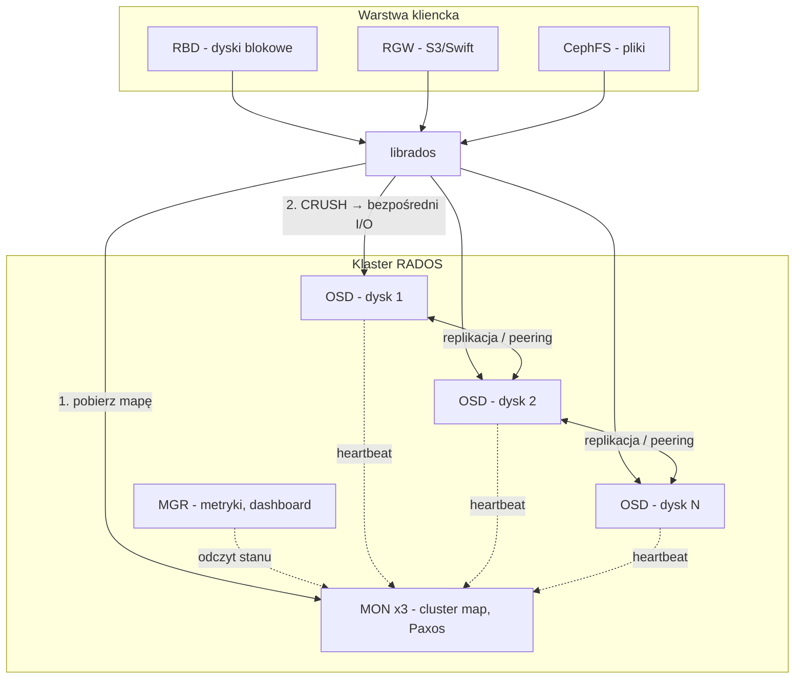
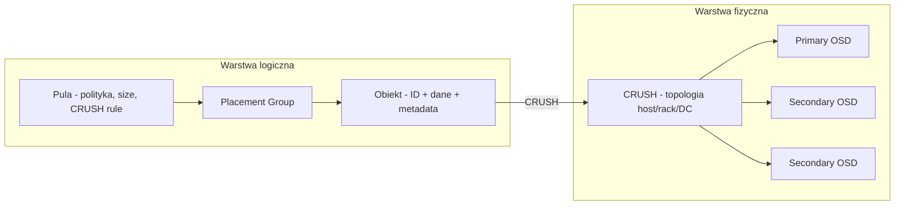
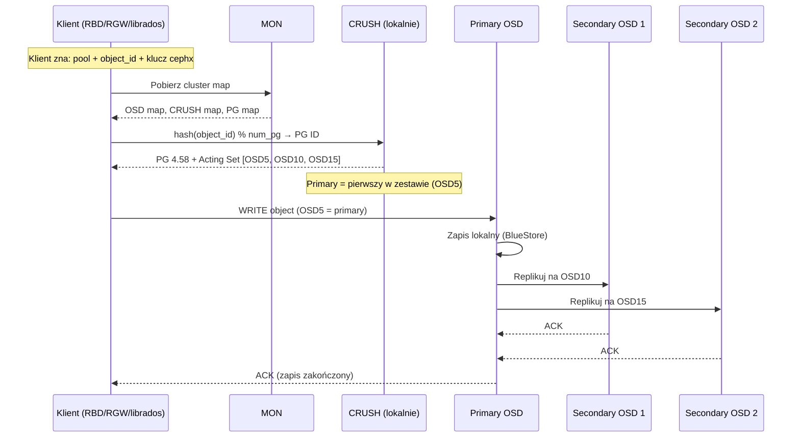
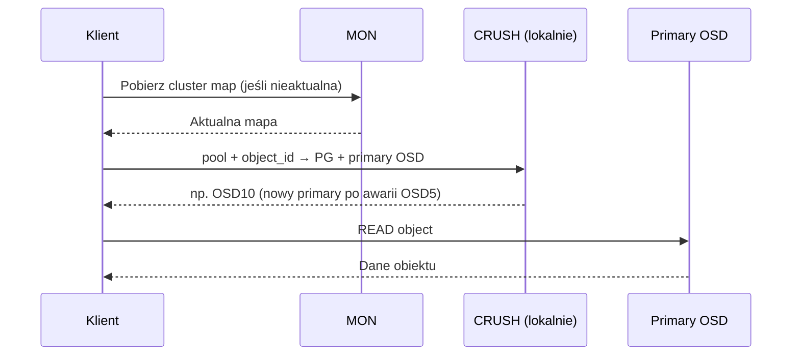
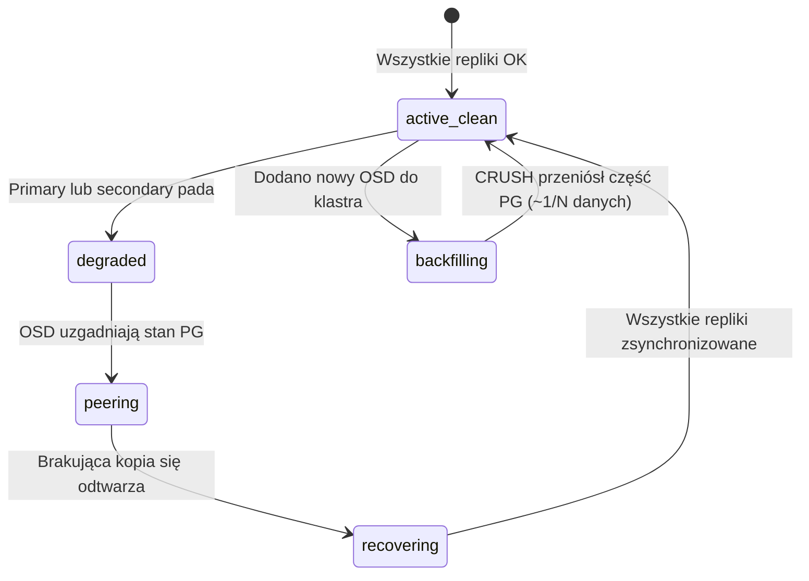
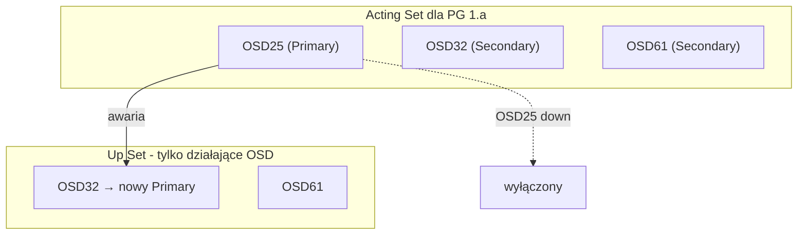

# Ceph — diagramy architektury

## 1. Komponenty klastra

---

## 2. Hierarchia danych

---

## 3. Ścieżka zapisu (krok po kroku)

---

## 4. Ścieżka odczytu

---

## 5. Awaria OSD i recovery

---

## 6. Acting Set vs Up Set

**Zasada:** Tylko **Primary** przyjmuje zapisy od klienta. Po awarii primary kolejny OSD w Acting Set przejmuje rolę.

---

## Legenda skrótów

| Skrót | Znaczenie |
|-------|-----------|
| RADOS | Reliable Autonomic Distributed Object Store |
| MON | Monitor — trzyma cluster map |
| OSD | Object Storage Daemon — jeden dysk |
| PG | Placement Group — jednostka replikacji |
| CRUSH | Algorytm rozmieszczania danych |
| EC | Erasure Coding — K+M chunków zamiast pełnych kopii |
